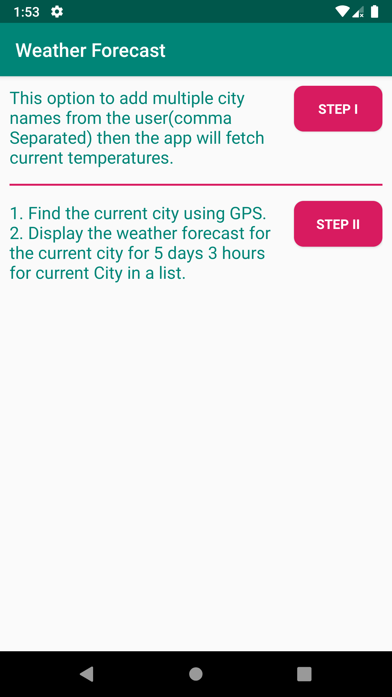
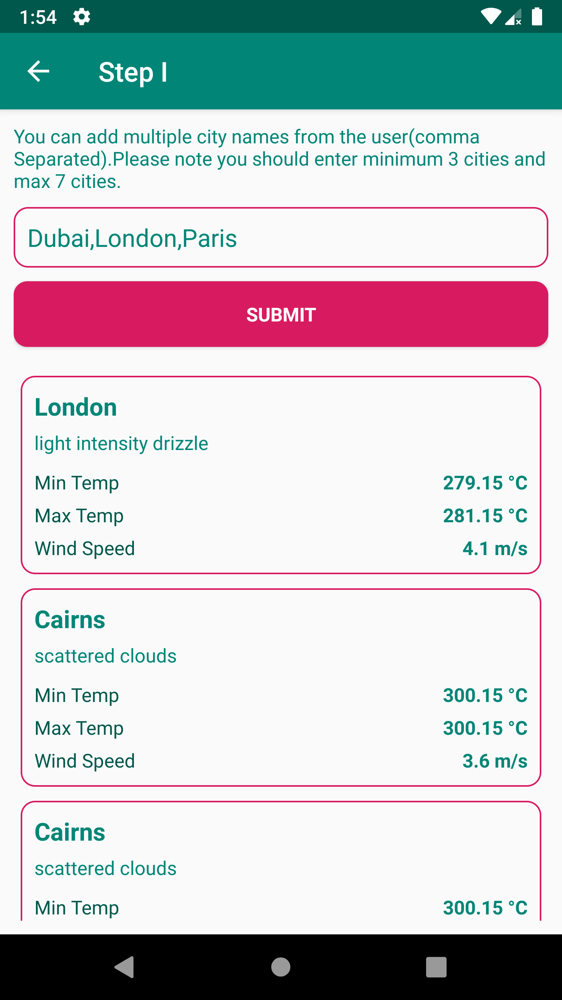
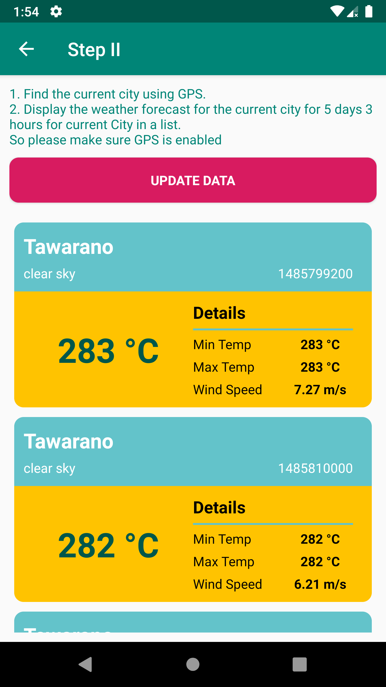

# Weather App
This is a small app to fetch the weather forecast of multiple cities. 

# Features
1. Provides services for getting the most popular articles on NYTimes.com based on emails, shares, or views.

2. Show article in details.

# Example Calls
https://api.nytimes.com/svc/mostpopular/v2/emailed/7.json?api-key=yourkey

https://api.nytimes.com/svc/mostpopular/v2/shared/1/facebook.json?api-key=yourkey

https://api.nytimes.com/svc/mostpopular/v2/viewed/1.json?api-key=yourkey

# Requirements

Android 5.0 (API 21) or above

Build with Android Studio 3.5.3 Beta 2

# Disclaimer
The application working online.

# Built With
New York Times API - Demo account 

Kotlin - A free, open source, statically typed “pragmatic” programming language initially designed for the JVM (JVM) and Android that combines object-oriented and functional programming features. It is focused on interoperability, safety, clarity, and tooling support.

Room - Room provides an abstraction layer over SQLite to allow fluent database access while harnessing the full power of SQLite.

LiveData - An observable data holder class. Unlike a regular observable, LiveData is lifecycle-aware, meaning it respects the lifecycle of other app components, such as activities, fragments, or services. This awareness ensures LiveData only updates app component observers that are in an active lifecycle state.

MVVM - MVVM is one of the architectural patterns which enhances separation of concerns, it allows separating the user interface logic from the business (or the back-end) logic. Its target (with other MVC patterns goal) is to achieve the following principle “Keeping UI code simple and free of app logic in order to make it easier to manage”.

Navigation - It refers to the interactions that allow users to navigate across, into, and back out from the different pieces of content within your app. Android Jetpack's Navigation component helps you implement navigation, from simple button clicks to more complex patterns, such as app bars and the navigation drawer. The Navigation component also ensures a consistent and predictable user experience by adhering to an established

Retrofit - A type-safe HTTP client for Android and Java

Gson - A Java serialization/deserialization library to convert Java Objects into JSON and back

Espresso - to write concise, beautiful, and reliable Android UI tests.

# Screenshotes 

 
 

# Licence
mostafa-emad
